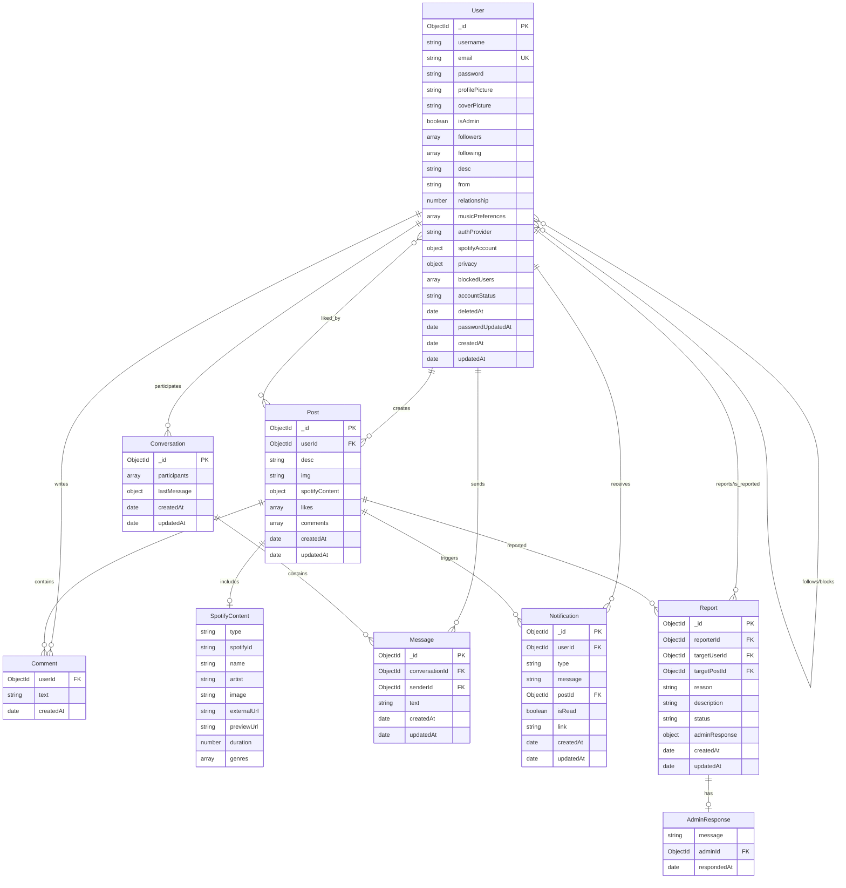
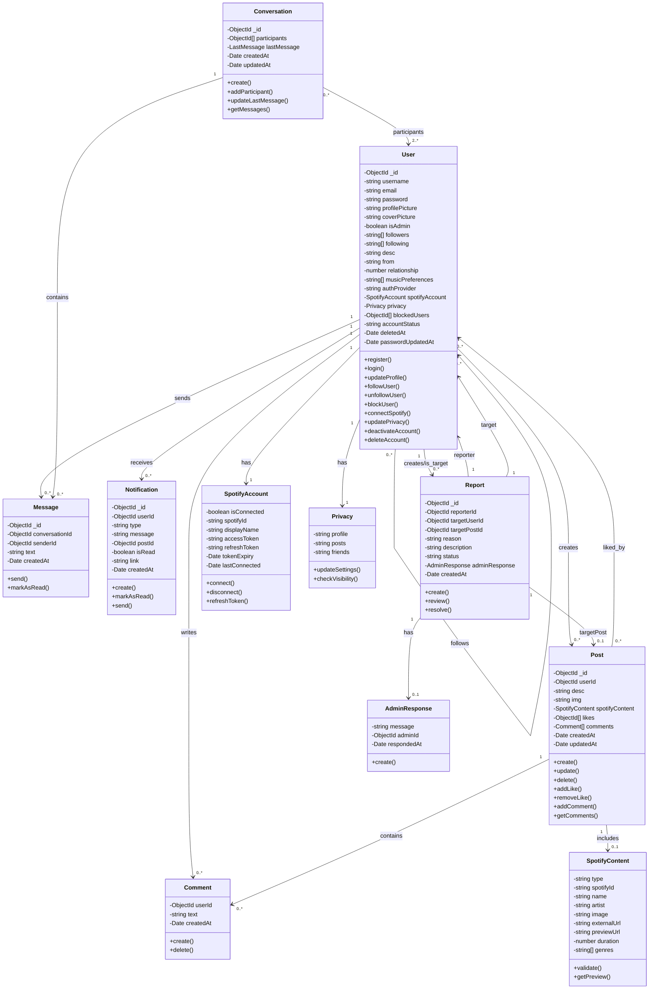

# RhythMe - Architecture Diagrams

This document contains the architectural diagrams for the RhythMe social music platform in Mermaid format.

## 1. Entity-Relationship Model (MER)

This diagram shows the database entities and their relationships:



## 2. UML Class Diagram

This diagram shows the main classes and their relationships in the system:



## 3. System Architecture Diagram

This diagram shows the overall system architecture and component interactions:

```mermaid
graph TB
    subgraph "Frontend Layer"
        FE[React Frontend<br/>Vite + React Router]
        FE --> Auth[Authentication Pages]
        FE --> Home[Home Feed]
        FE --> Profile[User Profiles]
        FE --> Admin[Admin Panel]
        FE --> Messages[Real-time Messaging]
    end

    subgraph "API Gateway"
        API[Express.js Server<br/>Port 5000]
        API --> CORS[CORS Middleware]
        API --> Helmet[Helmet Security]
        API --> Morgan[Morgan Logging]
        API --> Compress[Compression]
    end

    subgraph "Authentication Layer"
        JWT[JWT Tokens]
        LocalAuth[Local Authentication]
        GoogleAuth[Google OAuth 2.0]
        SpotifyAuth[Spotify OAuth 2.0]
    end

    subgraph "Business Logic Layer"
        Controllers[Controllers Layer]
        Controllers --> UserCtrl[User Controller]
        Controllers --> PostCtrl[Post Controller]
        Controllers --> AuthCtrl[Auth Controller]
        Controllers --> SpotifyCtrl[Spotify Controller]
        Controllers --> MessageCtrl[Message Controller]
        Controllers --> NotificationCtrl[Notification Controller]
        
        Services[Services Layer]
        Services --> UserSvc[User Service]
        Services --> PostSvc[Post Service]
        Services --> AuthSvc[Auth Service]
        Services --> SpotifySvc[Spotify Service]
        Services --> MessageSvc[Message Service]
        Services --> NotificationSvc[Notification Service]
    end

    subgraph "Real-time Communication"
        SocketIO[Socket.IO Server]
        SocketIO --> PostEvents[Post Events]
        SocketIO --> MessageEvents[Message Events]
        SocketIO --> UserEvents[User Events]
        SocketIO --> Notifications[Real-time Notifications]
    end

    subgraph "Data Layer"
        MongoDB[(MongoDB Atlas<br/>Document Database)]
        Models[Mongoose Models]
        Models --> UserModel[User Model]
        Models --> PostModel[Post Model]
        Models --> MessageModel[Message Model]
        Models --> ConversationModel[Conversation Model]
        Models --> NotificationModel[Notification Model]
        Models --> ReportModel[Report Model]
    end

    subgraph "External Services"
        SpotifyAPI[Spotify Web API]
        EmailSvc[Email Service<br/>SMTP]
        GoogleAPI[Google OAuth API]
    end

    subgraph "Infrastructure"
        FileStorage[File Storage<br/>Images/Media]
        Indexes[Database Indexes<br/>Performance Optimization]
        Security[Security Layer<br/>Bcrypt + Validation]
    end

    %% Frontend to API
    FE -.->|HTTP/HTTPS| API
    FE -.->|WebSocket| SocketIO

    %% API Flow
    API --> Controllers
    Controllers --> Services
    Services --> Models
    Models --> MongoDB

    %% Authentication Flow
    API --> JWT
    API --> LocalAuth
    API --> GoogleAuth
    API --> SpotifyAuth

    %% External Services
    SpotifyCtrl -.->|API Calls| SpotifyAPI
    AuthCtrl -.->|OAuth| GoogleAPI
    NotificationSvc -.->|Email| EmailSvc
    SpotifySvc -.->|OAuth + API| SpotifyAPI

    %% Real-time Communication
    Controllers --> SocketIO
    Services --> SocketIO

    %% Infrastructure
    Services --> Security
    MongoDB --> Indexes
    API --> FileStorage

    %% Styling
    classDef frontend fill:#e1f5fe
    classDef api fill:#f3e5f5
    classDef auth fill:#fff3e0
    classDef business fill:#e8f5e8
    classDef realtime fill:#fff8e1
    classDef data fill:#fce4ec
    classDef external fill:#f1f8e9
    classDef infra fill:#f5f5f5

    class FE,Auth,Home,Profile,Admin,Messages frontend
    class API,CORS,Helmet,Morgan,Compress api
    class JWT,LocalAuth,GoogleAuth,SpotifyAuth auth
    class Controllers,UserCtrl,PostCtrl,AuthCtrl,SpotifyCtrl,MessageCtrl,NotificationCtrl,Services,UserSvc,PostSvc,AuthSvc,SpotifySvc,MessageSvc,NotificationSvc business
    class SocketIO,PostEvents,MessageEvents,UserEvents,Notifications realtime
    class MongoDB,Models,UserModel,PostModel,MessageModel,ConversationModel,NotificationModel,ReportModel data
    class SpotifyAPI,EmailSvc,GoogleAPI external
    class FileStorage,Indexes,Security infra
```



## 4. Component Architecture Diagram

This diagram shows the detailed component structure and data flow:

```mermaid
graph LR
    subgraph "Frontend Components"
        subgraph "Pages"
            LoginPage[Login/Register]
            HomePage[Home Feed]
            ProfilePage[User Profile]
            EditProfilePage[Edit Profile]
            AdminPage[Admin Panel]
            PostDetailPage[Post Detail]
        end
        
        subgraph "Components"
            Navbar[Navigation Bar]
            Feed[Post Feed]
            PostCard[Post Card]
            Stories[Stories Component]
            SpotifyWidget[Spotify Widget]
            UserCard[User Card]
            CommentSection[Comment Section]
            MessageList[Message List]
            NotificationList[Notification List]
            SearchBar[Search Bar]
        end
        
        subgraph "Hooks & Utils"
            useAuth[useAuth Hook]
            useSocket[useSocket Hook]
            useFollow[useFollow Hook]
            API[API Utils]
            SocketProvider[Socket Provider]
        end
    end

    subgraph "Backend Routes"
        AuthRoutes[/api/v1/auth/*]
        UserRoutes[/api/v1/users/*]
        PostRoutes[/api/v1/posts/*]
        SpotifyRoutes[/api/v1/spotify/*]
        MessageRoutes[/api/v1/messages/*]
        ConversationRoutes[/api/v1/conversations/*]
        NotificationRoutes[/api/v1/notifications/*]
    end

    subgraph "Controllers"
        AuthController[Auth Controller]
        UserController[User Controller]
        PostController[Post Controller]
        SpotifyController[Spotify Controller]
        MessageController[Message Controller]
        NotificationController[Notification Controller]
    end

    subgraph "Services"
        AuthService[Auth Service]
        UserService[User Service]
        PostService[Post Service]
        SpotifyService[Spotify Service]
        MessageService[Message Service]
        NotificationService[Notification Service]
    end

    subgraph "Models & Database"
        UserModel[User Model]
        PostModel[Post Model]
        MessageModel[Message Model]
        ConversationModel[Conversation Model]
        NotificationModel[Notification Model]
        ReportModel[Report Model]
        MongoDB[(MongoDB)]
    end

    %% Frontend Flow
    LoginPage --> useAuth
    HomePage --> Feed
    Feed --> PostCard
    PostCard --> SpotifyWidget
    PostCard --> CommentSection
    ProfilePage --> UserCard
    AdminPage --> NotificationList

    %% API Communication
    useAuth -.->|HTTP| AuthRoutes
    API -.->|HTTP| UserRoutes
    API -.->|HTTP| PostRoutes
    API -.->|HTTP| SpotifyRoutes
    API -.->|HTTP| MessageRoutes
    API -.->|HTTP| NotificationRoutes

    %% Socket Communication
    useSocket -.->|WebSocket| SocketProvider
    SocketProvider -.->|Events| Feed
    SocketProvider -.->|Events| MessageList
    SocketProvider -.->|Events| NotificationList

    %% Backend Flow
    AuthRoutes --> AuthController
    UserRoutes --> UserController
    PostRoutes --> PostController
    SpotifyRoutes --> SpotifyController
    MessageRoutes --> MessageController
    NotificationRoutes --> NotificationController

    AuthController --> AuthService
    UserController --> UserService
    PostController --> PostService
    SpotifyController --> SpotifyService
    MessageController --> MessageService
    NotificationController --> NotificationService

    AuthService --> UserModel
    UserService --> UserModel
    PostService --> PostModel
    MessageService --> MessageModel
    MessageService --> ConversationModel
    NotificationService --> NotificationModel

    UserModel --> MongoDB
    PostModel --> MongoDB
    MessageModel --> MongoDB
    ConversationModel --> MongoDB
    NotificationModel --> MongoDB
    ReportModel --> MongoDB
```

## 5. Database Schema Overview

Key relationships and constraints:

### Users
- **Primary Key**: `_id` (ObjectId)
- **Unique Constraints**: `email`
- **Indexes**: `email`, `username`, `following`, `followers`
- **Self-referencing**: followers/following arrays contain User IDs

### Posts
- **Primary Key**: `_id` (ObjectId)
- **Foreign Keys**: `userId` → User, `likes[]` → User, `comments.userId` → User
- **Embedded Documents**: `comments[]`, `spotifyContent`
- **Indexes**: `userId`, `createdAt`, `spotifyContent.genres`, `likes`, `comments.createdAt`

### Messages & Conversations
- **Conversations**: contain array of participant User IDs
- **Messages**: reference Conversation and sender User
- **Indexes**: conversation participants, message timestamps

### Notifications
- **Foreign Keys**: `userId` → User, `postId` → Post (optional)
- **Types**: like, comment, follow, message, etc.

### Reports
- **Foreign Keys**: `reporterId` → User, `targetUserId` → User, `targetPostId` → Post (optional), `adminResponse.adminId` → User
- **Status**: open, reviewed
- **Indexes**: reporter, target user, creation date

## Technology Stack Summary

- **Frontend**: React 18 + Vite, React Router, Socket.io-client
- **Backend**: Node.js + Express.js, Socket.io
- **Database**: MongoDB with Mongoose ODM
- **Authentication**: JWT, bcrypt, Google OAuth 2.0, Spotify OAuth 2.0
- **Real-time**: Socket.io for live updates
- **External APIs**: Spotify Web API, Google OAuth API
- **Security**: Helmet, CORS, input validation
- **Email**: SMTP for notifications and password reset
- **Testing**: Jest for unit and integration tests
